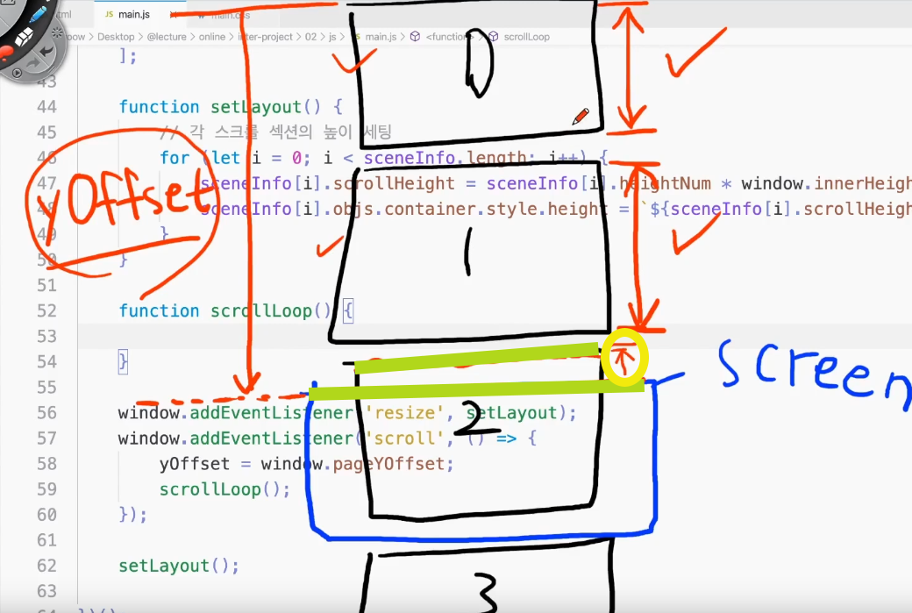

### 강의 정리 - 스크롤 처리 기본 개념 잡기

<br />

0. (앞 시간) 각 스크롤 섹션의 scrollheight를 실제 섹션의 높이로 적용
1. 몇 번째 스크롤 섹션이 눈 앞에 있는지를 구해보자.
2. 이를 위해선 스크롤 이벤트를 바인딩함. 스크롤 될 때 스크롤 값을 가져와서 처리하는 것이기 때문에.

```javascript
window.addEventListener('scroll', () => {});
```

3. 스크롤은 복잡하게 동작할 것이므로 단순히 함수 하나를 이벤트 핸들러로 넣는 게 아니라, 일단 익명 함수를 넣고 이 안에서 구체적인 역할을 하는 함수들을 호출
4. scrollLoop : 스크롤하면 기본적으로 실행되는 함수. 현재 눈앞에 몇번째 스크롤 섹션이 보이는지를 판별할 함수로 만들 것이다.

```javascript
function scrollLoop() {}

window.addEventListener('scroll', () => {
  scrollLoop();
});
```

5. y축으로 스크롤한 값인 pageYOffset은 자주 쓰이고 또 약간의 변형을 통해서도 사용할 예정이므로 변수에 넣고 쓰자. 변수이니 let으로 선언하고 일단 0으로 초기화. 스크롤 될 때 마다(scrollLoop가 호출될 때 마다) 현재 스크롤 값인 yOffset값으로 '갱신'된다.

```javascript
let yOffset = 0; // window.pageYOffset 대신 쓸 변수 (최상단에 선언)

window.addEventListener('scroll', () => {
  // window.pageYOffset : 현재 스크롤한 위치
  yOffset = window.pageYOffset;
  scrollLoop();
});
```

<br />
<br />


2번의 상단 부분과 스크린의 상단 부분이 닿으면 2번씬이 시작된다.(초록선)
즉, 현재 스크롤값(yOffset)이 0과 1씬의 스크롤 높이 합보다 크면 2씬이 현재씬. 다시말해 '현재 스크롤값 > 이전 씬들의 스크롤 높이합' 커야 현재씬임. 그 반대면(<) 아직 시작되지 않은 것.
<br />
