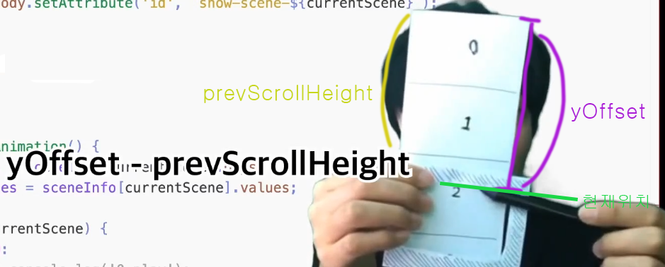

### 강의 정리 - 스크롤 애니메이션 구현 2

<br />

이제 스크롤에 따른 css의 변화를 계산하기 위해 calcValues 함수를 만들어보자. 필요한 매개변수는 다음과 같다.

1. values : css '값변화'에 대한 정보. [시작값, 끝값] 형식의 배열
2. 현재씬에서 얼마나 스크롤이 얼마나 되었는지

```javascript
function calcValues(values, currentYOffset) {}
```

yOffset은 전체 문서의 스크롤 위치이므로 이를 두번째 매개변수로 사용하기 힘들다. 우리가 필요한 건 '현재씬'에서 얼만큼의 스크롤이 되어있는가이다. 왜냐하면 씬이 시작할 때 애니메이션이 시작되서 씬이 끝날 때 애니메이션도 끝나기 때문이다. 따라서 현재 스크롤 섹션에서 얼만큼 스크롤이 되었는지를 알아내야 한다.



현재씬에서 얼마나 스크롤 되었는지에 대한 값을 currentYOffset 이라 하자. currentYOffset은 yOffset에서 prevScrollHeight을 뺀 값이다.
<br />

---

calcValues를 호출하는 함수는 playAnimation 함수. calcValues를 이용하여 수치를 계산해 그 계산된 결과값으로 css 세팅한다.

```javascript
function playAnimation() {
  switch (currentScene) {
    case 0:
      calcValues();
      //css 내용
      break;
  }
}
```
