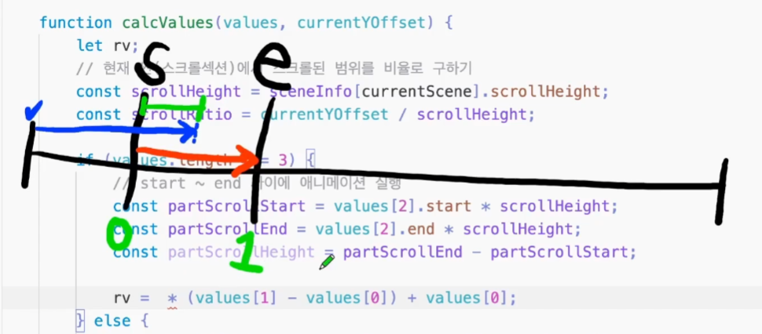

### 강의 정리 - 특정 타이밍 스크롤 애니메이션 기능 추가

<br />
현재 우리가 만든 건 현재씬 전체에 애니메이션이 적용되어 있는데 원본은 화면 가운데에서 애니메이션 요소가 나타난다. 이제 애니메이션이 등장할 특정 구간을 지정해보자.

이 타이밍에 대한 정보 또한 애니메이션에 관한 것이므로 sceneInfo 배열에 넣도록 하겠다.

```javascript
values: {
    messageA_opacity: [0, 1, {start: 0.1, end: 0.2}],
    messageB_opacity: [0, 1, {start: 0.3, end: 0.4}],
}

```

이제 calcValues 함수를 수정해보자. 현재의 계산식은 현재씬 '전체'를 처음부터 끝까지 스크롤을 했을 때 css의 변경값 정보이다.

```javascript
rv = scrollRatio * (values[1] - values[0]) + values[0];
```

하지만 전체가 아닌 특정 구간에서 나타나므로 분기처리를 해줘야 한다. start와 end가 명시된 요소들은 그 타이밍에 맞춰 값이 계산되어 적용되도록 한다. 즉, values에 2번째 인덱스가 있는 경우(=구체적인 start, end가 명시된 경우) start ~ end 사이에서 애니메이션 실행되도록 한다.

```javascript
function calcValues(values, currentYOffset) {
  ...
  if (values.length === 3) {
    const partScrollStart = values[2].start * scrollHeight;
    const partScrollEnd = values[2].end * scrollHeight;
    //start와 end 사이의 구간
    const partScrollHeight = partScrollEnd - partScrollStart;

  ...
}
```

<br />
  rv를 구하는 식에서 scrollRatio가 변경되어야 한다. 이전에는 현재씬 전체 범위에 대한 비율이었지만, 지금은 특정 구간의 범위가 반영되어야 하기 때문이다.

<br />



전체는 현재씬 구간이다. start 지점에서 opacity가 0이고 end 지점에선 opacity가 1이다. 빨간선은 애니메이션이 나타나야 하는 특정 구간이다. 파란선은 현재씬 전체에서 스크롤 된 범위다. 초록선은 특정 구간 범위 내에서 스크롤 된 범위를 나타낸다. 우리가 구해야하는 것은 이 초록색 구간이다. 따라서 파란선에서 start구간을 뺀 게 초록색이며, 이 초록색을 빨간선으로 나누면 특정 구간 내 스크롤 '비율'이다.

\* 정리 :

이건 현재씬 전체 범위 내에서 스크롤 된 비율(scrollRatio)에 따른 css 변경값이고,

```javascript
rv = scrollRatio * (values[1] - values[0]) + values[0];
```

특정 구간 내 스크롤 된 비율에 따른 css 변경값이다.

```javascript
rv =
  ((currentYOffset - partScrollStart) / partScrollHeight) *
    (values[1] - values[0]) +
  values[0];
```

```javascript
function calcValues(values, currentYOffset) {
  let rv;
  // 현재 씬(스크롤 섹션)에서 스크롤된 범위를 비율로 구하기
  const scrollHeight = sceneInfo[currentScene].scrollHeight;
  const scrollRatio = currentYOffset / scrollHeight;

  if (values.length === 3) {
    // start ~ end 사이에 애니메이션 실행
    const partScrollStart = values[2].start * scrollHeight;
    const partScrollEnd = values[2].end * scrollHeight;
    const partScrollHeight = partScrollEnd - partScrollStart;

    rv =
      ((currentYOffset - partScrollStart) / partScrollHeight) *
        (values[1] - values[0]) +
      values[0];
  } else {
    // 특정 구간이 설정되어 있지 않으면 그냥 현재씬 전체 범위에서 애니메이션 실행
    rv = scrollRatio * (values[1] - values[0]) + values[0];
  }

  return rv;
}
```

<br />

---

그런데 스크롤이 start 지점에 닿기 전이라면 start일 때의 애니메이션이, end 지점을 넘어서면 end 일 때의 애니메이션이 유지되도록 한다.


<br />

---

```javascript
if (values.length === 3) {
    // start ~ end 사이에 애니메이션 실행
    const partScrollStart = values[2].start * scrollHeight;
    const partScrollEnd = values[2].end * scrollHeight;
    const partScrollHeight = partScrollEnd - partScrollStart;

    // 스크롤이 특정 구간 내 범위 안에 있는 경우의 css(애니메이션) 변화값
    if (currentYOffset >= partScrollStart && currentYOffset <= partScrollEnd) {
        rv = (currentYOffset - partScrollStart) / partScrollHeight * (values[1] - values[0]) + values[0];
       // 스크롤이 아직 start 지점에 닿지 않은 경우의 css(애니메이션)
    } else if (currentYOffset < partScrollStart) {
        rv = values[0];
        // 스크롤이 end 지점을 넘어간 경우의 css(애니메이션)
    } else if (currentYOffset > partScrollEnd) {
        rv = values[1];
    }
} else {
    // 특정 구간이 설정되어 있지 않으면 그냥 현재씬 전체 범위에서 애니메이션 실행
    rv = scrollRatio * (values[1] - values[0]) + values[0];
}

return rv;
}
```
