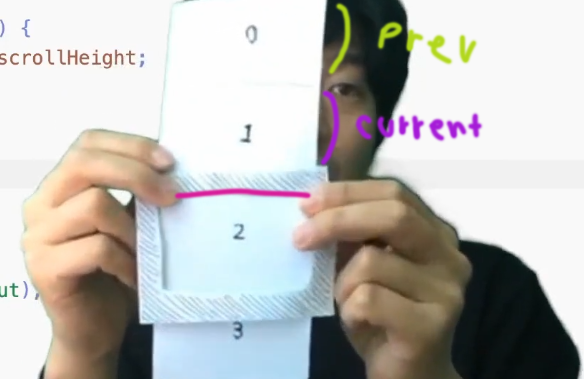
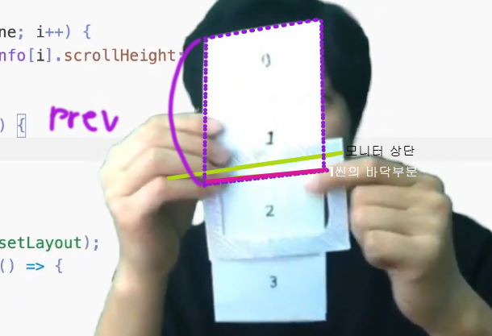

### 강의 정리 - 현재 활성시킬 씬 결정하기

<br />

이제 이 그림을 직접 구현해보자.


```javascript
// 필요한 변수 선언
let prevScrollHeight = 0; // 현재 스크롤 위치(yOffset)보다 이전에 위치한 스크롤 섹션들의 스크롤 높이값의 합
let currentScene = 0; //현재 활성화된 씬
```

활성화 시킬 씬의 번호를 결정하는 함수를 작성하기 앞서, prevScrollHeight에 모든 씬들의 scrollheight을 모두 더해서 전체 스크롤 크기가 나오는지 테스트해보자.

```javascript
function scrollLoop() {
  prevScrollHeight = 0; // 스크롤 될 때 마다 값이 초기화
  for (let i = 0; i < sceneInfo.length; i++) {
    prevScrollHeight += sceneInfo[i].scrollHeight;
  }
  console.log(prevScrollHeight);
}
```

초기화 해줄 prevScrollHeight = 0; 를 반드시 작성해야 한다. 그렇지 않으면 모든 씬들을 더한 값들이 누적되어 제대로 된 값이 나오지 않는다.
초기화를 하면 스크롤할 때마다 모든 씬들의 scrollHeight 합의 값이 제대로 출력된다.

근데 지금 내가 구하고자하는 것은 현재씬임.
따라서 전체씬 모두가 아니라 이전 씬들까지만 더해주면 되는 것.
<br/>따라서 i < sceneInfo.length 가 아닌 currentScene이어야 한다.
<br />

---

<br />



현재씬이 1이라고 가정해보자. prevScrollHeight는 씬0의 scrollheight값이고 currentScrollHeight는 씬1의 scrollheight값일 것이다. prevScrollHeight와 currentScrollHeight값의 합이 yOffset값(=모니터 상단)과 같아지는 순간 씬2의 상단이 모니터 상단에 닿는 순간일 것이다.
<br/>
따라서 'prevScrollHeight + currentScrollHeight < yOffset' 일 때 다음씬으로 넘어가므로 이 때 currentScene++을 해줘야한다.

<br/>

---

반대로 currentScene-- 되어야 하는 상황을 살펴보도록 하겠다. 앞에서는 다음에 나올 씬이 완전히 모니터에 꽉 다 찼을 때 현재씬이 되면서 currentScene++이 되었지만, 이번에는 앞의 씬이 약간만 나와도 currentScene--가 된다.



현재씬이 씬2 라고 가정해보자. 지금 스크롤을 올리면서 씬1이 모니터에 빼꼼 나왔다. 이 때부터 바로 현재씬은 씬1이 되는 것이다. 즉, prevScrollHeight가 YOffset보다 커야 currentScene--이 되는 것.

```javascript
function scrollLoop() {
  // 활성화 시킬 씬의 번호 결정
  prevScrollHeight = 0;
  for (let i = 0; i < currentScene; i++) {
    prevScrollHeight += sceneInfo[i].scrollHeight;
  }

  if (yOffset > prevScrollHeight + sceneInfo[currentScene].scrollHeight) {
    currentScene++;
  }

  if (yOffset < prevScrollHeight) {
    currentScene--;
  }
}
```

\*\* 혹시나 SceneInfo[currentScene]에 왜 currentScene이 들어가는지 의문이 들까봐 추가하는 내용. 처음에 'currentScene= 0' 이라고 선언을 하였다. 따라서 [currentScene] 에는 실질적으로 숫자 0이 들어간다. 화면이 0씬부터 시작되니까. 이후로 스크롤하면 알아서 currentScene이 ++ 혹은 -- 되면서 currentScene의 숫자가 바뀌는 것.

<br />

---

모바일 스크롤 바운스 효과

크롬의 경우 바운스 효과를 주었을 때 스크롤 취급을 하지 않지만 ios 모바일의 경우 마이너스 취급한다. 이는 현재씬이 0인 상황에서도 current--이 되어 currentScene= -1 이 될 수 있는 문제가 생긴다. 따라서 사전에 방지를 하자.

```javascript
if (yOffset < prevScrollHeight) {
  if (currentScene === 0) return; // 0일 땐 --하지 말고 바로 종료.
  currentScene--;
}
```

<br />
[!] 여기서 버그. 씬이 2, 3일 때 f5를 누르면 현재씬이 1로 뜬다. 화면은 그대로이고 스크롤하면 바로 2,3으로 뜨긴 하지만 찝찝...
